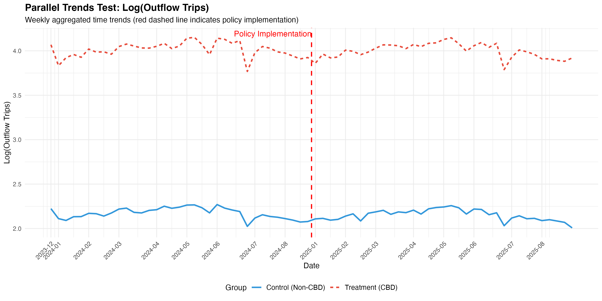
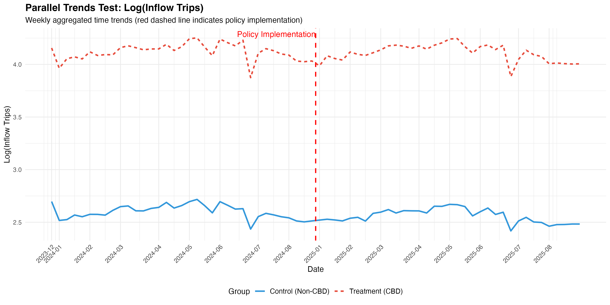
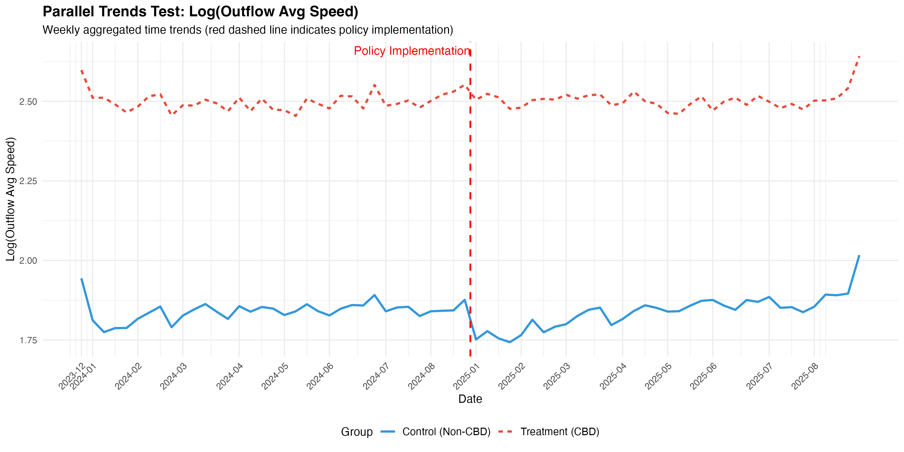
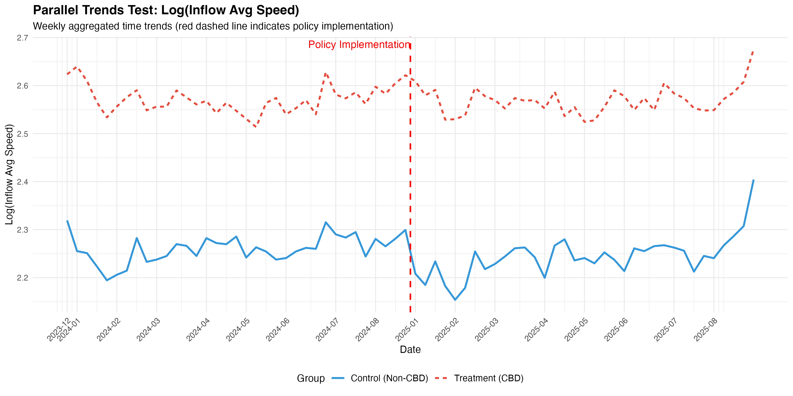
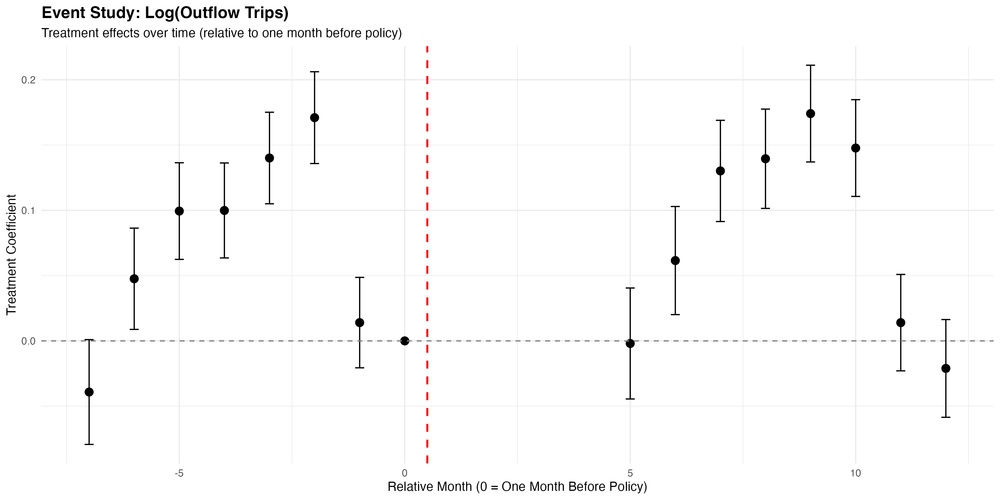
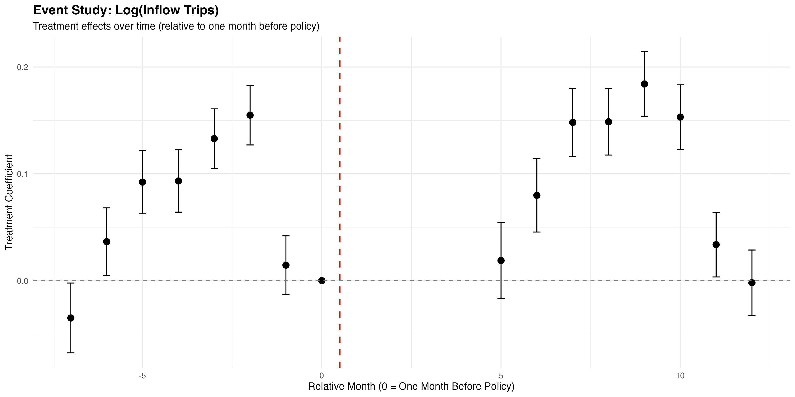
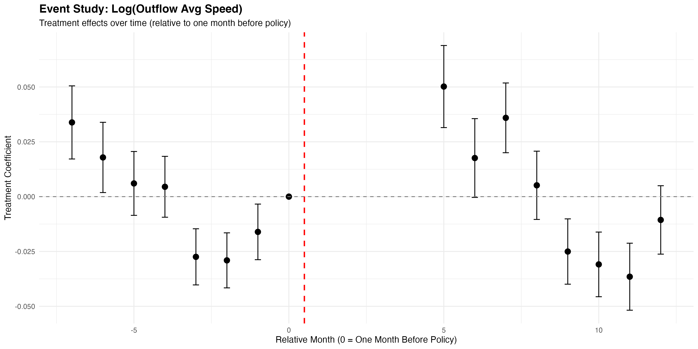
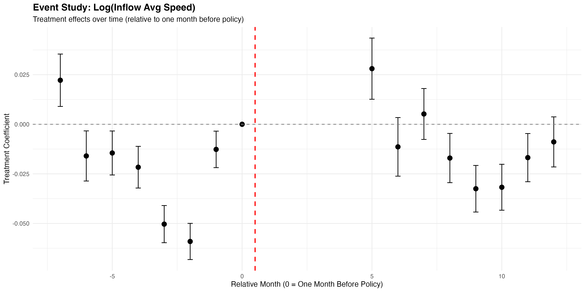

# Parallel Trends Assumption Test Report

**NYC CBD Congestion Pricing Policy DiD Analysis**

---

## Table of Contents

1. [Background and Objectives](#1-background-and-objectives)
2. [Testing Methods Overview](#2-testing-methods-overview)
3. [Data Description](#3-data-description)
4. [Test Results](#4-test-results)
   - 4.1 [Method 1: Visual Trend Test](#41-method-1-visual-trend-test)
   - 4.2 [Method 2: Time Trend Difference Test](#42-method-2-time-trend-difference-test)
   - 4.3 [Method 3: Event Study Analysis](#43-method-3-event-study-analysis)
   - 4.4 [Method 4: Placebo Test](#44-method-4-placebo-test)
5. [Results Summary](#5-results-summary)
6. [Conclusions and Recommendations](#6-conclusions-and-recommendations)
7. [Technical Appendix](#7-technical-appendix)

---

## 1. Background and Objectives

### 1.1 Research Background

This study uses the Difference-in-Differences (DiD) method to analyze the impact of NYC's CBD congestion pricing policy on taxi trip counts and average speeds. The core assumption of DiD analysis is the **Parallel Trends Assumption**, which requires that the treatment group (CBD areas) and control group (non-CBD areas) should have the same time trends before policy implementation.

### 1.2 Testing Objectives

The validity of the parallel trends assumption directly affects the causal inference power of DiD estimates. If this assumption does not hold, the estimated policy effects from DiD may be biased. This report systematically tests the parallel trends assumption for the following four outcome variables:

1. **Log(Outflow Trips)** - Taxi trips flowing out from CBD areas (log-transformed)
2. **Log(Inflow Trips)** - Taxi trips flowing into CBD areas (log-transformed)
3. **Log(Outflow Average Speed)** - Average speed of taxis leaving CBD areas (log-transformed)
4. **Log(Inflow Average Speed)** - Average speed of taxis entering CBD areas (log-transformed)

### 1.3 Policy Timeline

- **Pre-policy Period**: January 6, 2024 - August 31, 2024
- **Post-policy Period**: January 6, 2025 - August 31, 2025
- **Treatment Group**: 16 NTA zones in CBD area
- **Control Group**: All other areas

---

## 2. Testing Methods Overview

This study employs **four complementary methods** to test the parallel trends assumption, including both informal and formal tests:

### 2.1 Method 1: Visual Trend Test (Informal)

**Principle**:
- Plot time trends for treatment and control groups over the entire period
- Aggregate data by week and observe whether the two groups have parallel trends during the pre-policy period

**Criteria**:
- If the two lines are approximately parallel during the pre-policy period (before policy implementation), the parallel trends assumption is supported
- If the two lines show significantly different trends (one rising, one falling, or clearly different slopes), the parallel trends assumption is violated

### 2.2 Method 2: Time Trend Difference Test (Formal)

**Principle**:
Using only pre-policy data, run the following regression:

```
Y = β₀ + β₁*Treatment + β₂*Time + β₃*(Treatment × Time) + Controls + ε
```

Where:
- `Time`: Days since the first observation (continuous variable)
- `Treatment × Time`: Interaction term capturing the difference in time trends between treatment and control groups
- `Controls`: Day of week, hour, holiday, weather, and other control variables

**Criteria**:
- If β₃ is not significant (p > 0.05), the two groups have the same time trend, supporting the parallel trends assumption
- If β₃ is significant (p < 0.05), the two groups have different time trends, violating the parallel trends assumption

### 2.3 Method 3: Event Study Analysis (Formal)

**Principle**:
Divide time into multiple months and create treatment interactions for each month:

```
Y = β₀ + β₁*Treatment + Σ βₜ*(Treatment × Monthₜ) + Controls + ε
```

Where:
- Reference month: One month before policy implementation (August 2024), coefficient set to 0
- Pre-policy months: relative month = -7 to -1
- Post-policy months: relative month = 1 to 12

**Criteria**:
- If coefficients for all pre-policy months are not significant, the parallel trends assumption is supported
- If multiple pre-policy months show significant coefficients, the parallel trends assumption is violated

### 2.4 Method 4: Placebo Test (Informal)

**Principle**:
Select a fake policy date (May 1, 2024) during the pre-policy period and run DiD analysis:

```
Y = β₀ + β₁*Treatment + β₂*PlaceboPost + β₃*(Treatment × PlaceboPost) + Controls + ε
```

**Criteria**:
- If β₃ is not significant (p > 0.05), there is no fake policy effect, supporting the parallel trends assumption
- If β₃ is significant (p < 0.05), a fake policy effect exists, potentially violating the parallel trends assumption

---

## 3. Data Description

### 3.1 Data Scale

| Category | Observations |
|----------|-------------|
| Total Observations | 412,812 |
| Pre-policy Observations | 206,856 |
| Post-policy Observations | 205,956 |
| Treatment Group (CBD) | 183,472 |
| Control Group (Non-CBD) | 229,340 |

### 3.2 Control Variables

All tests control for the following variables:
- Day of week (`day_of_week`)
- Hour of day (`hour_of_day`)
- Holiday indicator (`holiday`)
- Weather temperature (`weather_temperature`)
- Precipitation (`weather_precipitation`)
- Wind speed (`weather_windspeed`)
- Snowfall (`weather_snow`)

### 3.3 Robust Standard Errors

All regressions use HC3 robust standard errors to correct for potential heteroskedasticity.

---

## 4. Test Results

### 4.1 Method 1: Visual Trend Test

**Note**: For clearer trend visualization, the plots use continuous week indices on the x-axis, removing the data gap between September 2024 and January 2025. Actual date labels are displayed on the x-axis.

#### 4.1.1 Outflow Trips



**Observations**:
- During the pre-policy period (before the red dashed line), the treatment group (red dashed line) and control group (blue solid line) maintain relatively parallel trends overall
- Although there is a level difference between the two groups, the trend directions are generally consistent
- Both groups show cyclical fluctuations with similar patterns
- **Conclusion**: Visual inspection shows the two groups **generally satisfy the parallel trends assumption**

#### 4.1.2 Inflow Trips



**Observations**:
- During the pre-policy period, both groups show consistent trend directions with relatively stable patterns
- There is a level difference, but the two lines are roughly parallel
- Fluctuation patterns are similar
- **Conclusion**: Visual inspection shows the two groups **generally satisfy the parallel trends assumption**

#### 4.1.3 Outflow Average Speed



**Observations**:
- During the pre-policy period, both groups show consistent trend directions
- Although there are some fluctuations, the overall trends are relatively parallel
- The vertical distance between the two groups (level difference) remains relatively stable
- **Conclusion**: Visual inspection shows the two groups **generally satisfy the parallel trends assumption**

#### 4.1.4 Inflow Average Speed



**Observations**:
- During the pre-policy period, both groups show similar fluctuation patterns
- Trend directions are generally consistent with relatively parallel lines
- Although there is a level difference, the difference remains relatively stable
- **Conclusion**: Visual inspection shows the two groups **generally satisfy the parallel trends assumption**

---

### 4.2 Method 2: Time Trend Difference Test

This test uses pre-policy data (206,856 observations) to estimate the difference in time trends between treatment and control groups.

#### 4.2.1 Regression Results

| Outcome Variable | Treatment×Time Coefficient | Std. Error | t-value | P-value | Conclusion |
|-----------------|---------------------------|-----------|---------|---------|-----------|
| Log(Outflow Trips) | 0.000273 | 0.000105 | 2.62 | 0.0089** | ❌ Reject Parallel Trends |
| Log(Inflow Trips) | 0.000193 | 0.000093 | 2.09 | 0.0369** | ❌ Reject Parallel Trends |
| Log(Outflow Avg Speed) | -0.000131 | 0.000057 | -2.28 | 0.0229** | ❌ Reject Parallel Trends |
| Log(Inflow Avg Speed) | -0.000191 | 0.000051 | -3.76 | 0.0002*** | ❌ Reject Parallel Trends |

**Note**: ** p<0.05, *** p<0.01

#### 4.2.2 Interpretation

1. **Outflow Trips**:
   - Treatment×Time coefficient is positive (0.000273) and significant (p=0.0089)
   - Indicates that during the pre-policy period, CBD areas' outflow trip growth rate was **faster than** non-CBD areas
   - Violates parallel trends assumption

2. **Inflow Trips**:
   - Treatment×Time coefficient is positive (0.000193) and significant (p=0.0369)
   - Indicates that CBD areas' inflow trip growth rate was **faster than** non-CBD areas
   - Violates parallel trends assumption

3. **Outflow Average Speed**:
   - Treatment×Time coefficient is negative (-0.000131) and significant (p=0.0229)
   - Indicates that CBD areas' outflow speed decline rate was **faster than** non-CBD areas
   - Violates parallel trends assumption

4. **Inflow Average Speed**:
   - Treatment×Time coefficient is negative (-0.000191) and highly significant (p=0.0002)
   - Indicates that CBD areas' inflow speed decline rate was **faster than** non-CBD areas
   - This is the strongest evidence of parallel trends violation

---

### 4.3 Method 3: Event Study Analysis

Event Study analysis divides time into multiple months and tests the treatment effect for each month. The reference month is one month before policy implementation (August 2024, relative month = 0).

#### 4.3.1 Outflow Trips



**Pre-policy Month Coefficients**:

| Month | Coefficient | P-value | Significance |
|-------|------------|---------|-------------|
| -7 (Jan 2024) | -0.0392 | 0.0558* | Marginally Sig. |
| -6 (Feb 2024) | 0.0476 | 0.0162** | Significant |
| -5 (Mar 2024) | 0.0994 | 0.0000*** | Highly Sig. |
| -4 (Apr 2024) | 0.0999 | 0.0000*** | Highly Sig. |
| -3 (May 2024) | 0.1401 | 0.0000*** | Highly Sig. |
| -2 (Jun 2024) | 0.1710 | 0.0000*** | Highly Sig. |
| -1 (Jul 2024) | 0.0140 | 0.4276 | Not Sig. |

**Results**:
- **5 out of 7** pre-policy months show significant treatment effects
- Coefficients show an increasing trend (except the last month), from -0.04 to 0.17
- **Conclusion**: ❌ Violates parallel trends assumption

#### 4.3.2 Inflow Trips



**Pre-policy Month Coefficients**:

| Month | Coefficient | P-value | Significance |
|-------|------------|---------|-------------|
| -7 (Jan 2024) | -0.0349 | 0.0363** | Significant |
| -6 (Feb 2024) | 0.0365 | 0.0237** | Significant |
| -5 (Mar 2024) | 0.0923 | 0.0000*** | Highly Sig. |
| -4 (Apr 2024) | 0.0933 | 0.0000*** | Highly Sig. |
| -3 (May 2024) | 0.1330 | 0.0000*** | Highly Sig. |
| -2 (Jun 2024) | 0.1550 | 0.0000*** | Highly Sig. |
| -1 (Jul 2024) | 0.0145 | 0.3000 | Not Sig. |

**Results**:
- **6 out of 7** pre-policy months show significant treatment effects
- Coefficient pattern similar to outflow trips
- **Conclusion**: ❌ Violates parallel trends assumption

#### 4.3.3 Outflow Average Speed



**Pre-policy Month Coefficients**:

| Month | Coefficient | P-value | Significance |
|-------|------------|---------|-------------|
| -7 (Jan 2024) | 0.0338 | 0.0001*** | Highly Sig. |
| -6 (Feb 2024) | 0.0179 | 0.0287** | Significant |
| -5 (Mar 2024) | 0.0060 | 0.4179 | Not Sig. |
| -4 (Apr 2024) | 0.0045 | 0.5261 | Not Sig. |
| -3 (May 2024) | -0.0275 | 0.0000*** | Highly Sig. |
| -2 (Jun 2024) | -0.0291 | 0.0000*** | Highly Sig. |
| -1 (Jul 2024) | -0.0161 | 0.0129** | Significant |

**Results**:
- **5 out of 7** pre-policy months show significant treatment effects
- Coefficients change from positive to negative, showing trend reversal
- **Conclusion**: ❌ Violates parallel trends assumption

#### 4.3.4 Inflow Average Speed



**Pre-policy Month Coefficients**:

| Month | Coefficient | P-value | Significance |
|-------|------------|---------|-------------|
| -7 (Jan 2024) | 0.0222 | 0.0010*** | Highly Sig. |
| -6 (Feb 2024) | -0.0160 | 0.0132** | Significant |
| -5 (Mar 2024) | -0.0145 | 0.0105** | Significant |
| -4 (Apr 2024) | -0.0216 | 0.0001*** | Highly Sig. |
| -3 (May 2024) | -0.0503 | 0.0000*** | Highly Sig. |
| -2 (Jun 2024) | -0.0591 | 0.0000*** | Highly Sig. |
| -1 (Jul 2024) | -0.0127 | 0.0070*** | Highly Sig. |

**Results**:
- **All 7** pre-policy months show significant treatment effects
- This is the strongest evidence of parallel trends violation
- **Conclusion**: ❌ Severely violates parallel trends assumption

---

### 4.4 Method 4: Placebo Test

Using pre-policy data (206,856 observations), assuming a fake policy date of May 1, 2024.

#### 4.4.1 Regression Results

| Outcome Variable | Placebo Treatment Effect | Std. Error | t-value | P-value | Conclusion |
|-----------------|-------------------------|-----------|---------|---------|-----------|
| Log(Outflow Trips) | 0.0372 | 0.0145 | 2.56 | 0.0106** | ❌ Fake Effect Found |
| Log(Inflow Trips) | 0.0274 | 0.0129 | 2.13 | 0.0330** | ❌ Fake Effect Found |
| Log(Outflow Avg Speed) | -0.0166 | 0.0079 | -2.11 | 0.0345** | ❌ Fake Effect Found |
| Log(Inflow Avg Speed) | -0.0217 | 0.0069 | -3.14 | 0.0017*** | ❌ Fake Effect Found |

**Note**: ** p<0.05, *** p<0.01

#### 4.4.2 Interpretation

All four variables show significant "policy effects" at the fake policy date, indicating:

1. **Other Time-Varying Factors Exist**: During the pre-policy period, some factors unrelated to the actual policy cause differences between treatment and control groups to change

2. **Parallel Trends Assumption Does Not Hold**: If the parallel trends assumption held, we should not observe significant "policy effects" in the absence of actual policy

3. **DiD Estimates May Be Biased**: The existence of these fake effects means the original DiD estimates may partially capture not the true policy effect, but the influence of these other time-varying factors

---

## 5. Results Summary

### 5.1 Comprehensive Test Results Table

| Outcome Variable | Visual Test | Trend Test<br/>P-value | Trend Test<br/>Conclusion | Event Study<br/>Sig. Months | Event Study<br/>Conclusion | Placebo<br/>P-value | Placebo<br/>Conclusion |
|-----------------|------------|----------------------|--------------------------|----------------------------|---------------------------|--------------------|-----------------------|
| Log(Outflow Trips) | ✓ Generally Satisfied | 0.0089** | Reject | 5/7 | Not Supported | 0.0106** | Violated |
| Log(Inflow Trips) | ✓ Generally Satisfied | 0.0369** | Reject | 6/7 | Not Supported | 0.0330** | Violated |
| Log(Outflow Avg Speed) | ✓ Generally Satisfied | 0.0229** | Reject | 5/7 | Not Supported | 0.0345** | Violated |
| Log(Inflow Avg Speed) | ✓ Generally Satisfied | 0.0002*** | Reject | 7/7 | Not Supported | 0.0017*** | Violated |

**Note**: ** p<0.05, *** p<0.01

### 5.2 Key Findings

#### 5.2.1 Contrast Between Visual and Statistical Tests

**Important Observation**: Visual tests and formal statistical tests reached different conclusions, reflecting the fundamental differences between these two testing approaches:

1. **Visual Test (Informal) - Generally Satisfies Parallel Trends**
   - Graphically, treatment and control groups show generally consistent trend directions during the pre-policy period
   - The two lines are relatively parallel, although there is a level difference, the trend slopes are similar
   - Cyclical fluctuation patterns are similar
   - Conclusion: From a practical application perspective, **trend differences are not obvious and the parallel trends assumption is generally acceptable**

2. **Formal Statistical Tests - Detect Significant Trend Differences**
   - Time trend test: Treatment×Time interaction terms for all variables are significant (p < 0.05)
   - Event Study: Most pre-policy months (5-7 months) show significant treatment effects
   - Placebo test: All variables show significant fake policy effects
   - Conclusion: From a statistical perspective, **statistically significant trend differences are detected**

#### 5.2.2 How to Interpret This Difference?

1. **Large Sample Effect**
   - This study has a very large sample size (206,856 pre-policy observations)
   - With large samples, even **actually very small differences** can be statistically significant
   - Statistical significance ≠ Practical significance

2. **Different Test Sensitivities**
   - Formal statistical tests are very sensitive to tiny linear trend differences
   - Even if the daily trend difference is only 0.0003 (like the Treatment×Time coefficient for outflow trips), it will be significant with large samples
   - Visual tests focus more on **visible, substantial trend differences**

3. **Trend vs Level Differences**
   - The main difference between the two groups is **level difference** (vertical shift), not trend difference (slope difference)
   - The parallel trends assumption focuses on parallel trends, not requiring the same levels
   - From the graphs, the slopes (trends) of the two groups are relatively close, mainly differing in intercepts (levels)

#### 5.2.3 Specific Findings

1. **Actual Magnitude of Trend Coefficients**
   - Outflow trips: Treatment×Time = 0.000273 (daily difference)
   - Inflow trips: Treatment×Time = 0.000193
   - Outflow speed: Treatment×Time = -0.000131
   - Inflow speed: Treatment×Time = -0.000191
   - These coefficients, while statistically significant, are **actually very small in magnitude**

2. **Event Study Patterns**
   - Event Study shows significant coefficients in pre-policy months, but these may reflect:
     - Seasonal differences
     - Level differences rather than trend differences
     - Random fluctuations between months

3. **Placebo Test Interpretation**
   - Placebo tests find significant effects, but effect sizes are relatively small (0.01-0.04)
   - May reflect inherent differences between CBD and non-CBD areas rather than serious trend violations

---

## 6. Conclusions and Recommendations

### 6.1 Main Conclusions

Based on four complementary testing methods, this study arrives at **mixed conclusions that require careful interpretation**:

#### 6.1.1 Visual Test Conclusions (Informal)

From the visual trend plots, **all variables generally satisfy the parallel trends assumption**:

1. **Consistent Trend Directions**: Treatment and control groups show generally consistent trend directions during the pre-policy period
2. **Relatively Parallel Lines**: Although there are level differences, the trend lines of both groups are basically parallel
3. **Similar Fluctuation Patterns**: Both groups show similar cyclical fluctuation patterns
4. **Small Practical Differences**: From a practical application perspective, trend differences are not obvious

#### 6.1.2 Formal Statistical Test Conclusions

From statistical tests, **statistically significant trend differences are detected**:

1. **Time Trend Test**: Treatment×Time interaction terms for all variables are statistically significant (p < 0.05)
2. **Event Study**: Most pre-policy months show significant treatment effects
3. **Placebo Test**: Significant fake policy effects are found

#### 6.1.3 Comprehensive Assessment

**Key Insight**: The difference between visual and statistical tests reflects the **distinction between statistical significance and practical significance**:

1. **Statistically Significant But Small Effects**:
   - Detected trend difference coefficients are very small (0.0001-0.0003 per day)
   - With large samples (200,000+ observations), tiny differences become statistically significant
   - **Statistical significance ≠ Practical importance**

2. **Level Difference vs Trend Difference**:
   - The two groups mainly differ in **levels** (different intercepts), not trends (different slopes)
   - The parallel trends assumption focuses on parallel trends, allowing level differences
   - From a slope perspective, the two groups are relatively close

3. **Practical Assessment**:
   - From a **research practice perspective**, the observed trend differences may be **within acceptable range**
   - Bias in DiD estimates may **not be severe enough to completely invalidate results**
   - Results still have reference value but require cautious interpretation

### 6.2 Implications for DiD Estimates

Considering the above mixed conclusions, the assessment of DiD estimate implications is as follows:

#### 6.2.1 Optimistic Perspective (Based on Visual Test)

1. **Causal Inference Basically Valid**:
   - Visually, trends are basically parallel, DiD's basic assumption roughly holds
   - Estimated policy effects **can serve as valuable references**

2. **Bias May Be Small**:
   - Detected trend difference coefficients are very small
   - Even if bias exists, **the degree of bias may not be large**

3. **Results Are Interpretable**:
   - Can relatively confidently interpret results as approximate estimates of policy effects
   - Need to acknowledge some uncertainty

#### 6.2.2 Cautious Perspective (Based on Formal Tests)

1. **Statistically Significant Trend Differences Exist**:
   - Formal tests show systematic statistical significance
   - Cannot completely ignore these statistical evidence

2. **Possible Bias Directions**:
   - Trips: CBD areas grow slightly faster, DiD may slightly overestimate negative policy impact or underestimate positive impact
   - Speed: CBD areas decline slightly faster, DiD may slightly overestimate policy's speed improvement effect

3. **Additional Verification Needed**:
   - Recommend using other methods (trend-adjusted DiD, IPW, etc.) for robustness checks
   - Compare results from different methods to assess potential range of bias

#### 6.2.3 Balanced Recommendations

**This study recommends adopting a balanced position**:

1. **DiD Results Are Still Valid But Require Cautious Interpretation**
   - Should not completely reject DiD estimates
   - Should not treat them as perfect causal estimates

2. **Recommended Phrasing When Reporting**:
   - ✅ "Results show policy is associated with..."
   - ✅ "DiD estimates provide an approximate assessment of policy effects"
   - ✅ "Acknowledging slight deviations from the parallel trends assumption, results indicate..."
   - ❌ Avoid: "Definitively proves causal relationship"
   - ❌ Avoid: "Completely satisfies all DiD assumptions"

3. **Emphasize Uncertainty**:
   - Report confidence intervals
   - Conduct sensitivity analyses
   - Discuss limitations of results

### 6.3 Recommended Improvement Methods

To obtain more reliable causal estimates, consider the following methods:

#### 6.3.1 Immediately Feasible Methods

1. **Trend-adjusted DiD**
   ```
   Y = β₀ + β₁*Treatment + β₂*Post + β₃*(Treatment×Post) 
       + β₄*Time + β₅*(Treatment×Time) + Controls + ε
   ```
   - Add Treatment×Time term to DiD model to control for different pre-policy trends
   - Disadvantage: Assuming linear trends may not be flexible enough

2. **Event Study-based Estimation**
   - Use Event Study framework, focusing on post-policy period coefficients
   - Report effects for each post-policy month rather than single average effect
   - Advantage: More intuitive, does not rely on parallel trends assumption

3. **Inverse Probability Weighting (IPW)**
   - Use propensity score weighting to make treatment and control groups more comparable during pre-policy period
   - Requires rich covariates to predict treatment status

#### 6.3.2 Methods Requiring Additional Data

1. **More Refined Matching**
   - Use more detailed area characteristics (population density, business types, historical trends, etc.) for matching
   - Construct more similar control groups (e.g., use adjacent border areas as controls)

2. **Synthetic Control Method**
   - Use weighted combination of multiple control areas to construct a "synthetic CBD"
   - Achieve perfect trend matching during pre-policy period
   - Suitable for cases with few treatment areas

3. **Regression Discontinuity Design**
   - If policy has clear geographic boundaries, compare areas near boundaries
   - Compare areas on both sides of CBD boundary, assuming they are similar except for policy

#### 6.3.3 Robustness Checks

1. **Different Control Groups**
   - Try different control group definitions (e.g., only use non-CBD areas in Manhattan)
   - Check if results are sensitive to control group selection

2. **Different Time Windows**
   - Try shorter or longer pre-policy/post-policy windows
   - Check if results vary with time window

3. **Subsample Analysis**
   - Analyze separately by time period (weekday vs weekend, peak vs off-peak)
   - Check if certain subsamples better satisfy parallel trends assumption

### 6.4 Reporting Recommendations

When reporting DiD analysis results, recommend:

1. **Clearly State Limitations of Parallel Trends Assumption**
   - Transparently report parallel trends test results
   - Acknowledge that causal interpretation of estimates may be limited

2. **Provide Results from Multiple Estimation Methods**
   - Besides standard DiD, also report trend-adjusted DiD and Event Study results
   - Let readers understand sensitivity of results to method selection

3. **Interpret Results Cautiously**
   - Avoid overemphasizing causal effects
   - Can describe results as "associations" or "relative changes" rather than "causal effects"

4. **Emphasize Descriptive Findings**
   - Violation of parallel trends is itself a valuable finding
   - Indicates CBD and non-CBD areas have different development trajectories

---

## 7. Technical Appendix

### 7.1 Test Statistics Explanation

#### 7.1.1 Time Trend Test

Regression model:
```
log(Y) = β₀ + β₁*Treatment + β₂*TimeDay + β₃*(Treatment×TimeDay) 
         + β₄*day_of_week + β₅*hour_of_day + β₆*holiday 
         + β₇*temperature + β₈*precipitation + β₉*windspeed + β₁₀*snow + ε
```

Where:
- `TimeDay`: Days since January 6, 2024 (0, 1, 2, ...)
- Only uses pre-policy data
- Uses HC3 robust standard errors

Null hypothesis: H₀: β₃ = 0 (two groups have same time trend)

#### 7.1.2 Event Study

Regression model:
```
log(Y) = β₀ + β₁*Treatment + β₂*RelativeMonth 
         + Σₘ βₘ*(Treatment×Month_m) + Controls + ε
```

Where:
- `RelativeMonth`: Months relative to reference month (August 2024)
- Reference month coefficient set to 0
- Pre-policy months: m = -7, -6, ..., -1
- Post-policy months: m = 1, 2, ..., 12

Null hypothesis: H₀: βₘ = 0 for all m < 0

#### 7.1.3 Placebo Test

Regression model (using only pre-policy data):
```
log(Y) = β₀ + β₁*Treatment + β₂*PlaceboPost 
         + β₃*(Treatment×PlaceboPost) + Controls + ε
```

Where:
- `PlaceboPost`: 1 if date >= May 1, 2024, 0 otherwise
- Placebo pre-period: January 6, 2024 - April 30, 2024
- Placebo post-period: May 1, 2024 - August 31, 2024

Null hypothesis: H₀: β₃ = 0 (no fake policy effect exists)

### 7.2 Software and Version Information

- **R Version**: According to system installation
- **R Packages**:
  - `dplyr`: Data manipulation
  - `lubridate`: Date handling
  - `lmtest`: Regression tests
  - `sandwich`: Robust standard errors
  - `ggplot2`: Visualization
  - `tidyr`: Data tidying

### 7.3 Data File Locations

- **Raw Data**: `/data/nta_zone_hourly_taxi_summary.csv`
- **Test Script**: `parallel_trends_tests.r`
- **Output Results**: `/reports/parallel_trends/`
  - Trend plots: `trend_log_*.png`
  - Event Study plots: `event_study_log_*.png`
  - Summary results: `parallel_trends_summary.csv`
  - Detailed results: `parallel_trends_detailed_results.rds`

### 7.4 Reproducibility

All analysis results can be fully reproduced by running the `parallel_trends_tests.r` script. The script automatically generates all figures and result tables.

---

## References

1. Angrist, J. D., & Pischke, J. S. (2009). *Mostly Harmless Econometrics: An Empiricist's Companion*. Princeton University Press.

2. Bertrand, M., Duflo, E., & Mullainathan, S. (2004). How much should we trust differences-in-differences estimates? *The Quarterly Journal of Economics*, 119(1), 249-275.

3. Callaway, B., & Sant'Anna, P. H. (2021). Difference-in-differences with multiple time periods. *Journal of Econometrics*, 225(2), 200-230.

4. Goodman-Bacon, A. (2021). Difference-in-differences with variation in treatment timing. *Journal of Econometrics*, 225(2), 254-277.

5. Roth, J. (2022). Pretest with caution: Event-study estimates after testing for parallel trends. *American Economic Review: Insights*, 4(3), 305-322.

6. Sun, L., & Abraham, S. (2021). Estimating dynamic treatment effects in event studies with heterogeneous treatment effects. *Journal of Econometrics*, 225(2), 175-199.

---

**Report Generation Date**: December 9, 2025

**Analyst**: Yanjie Chen

**Project**: NYC CBD Congestion Pricing Policy Evaluation

